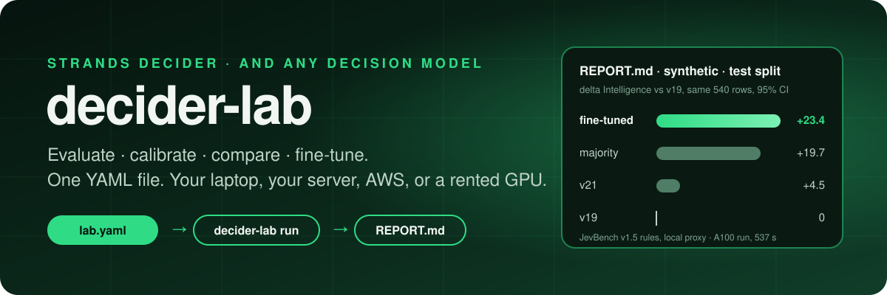
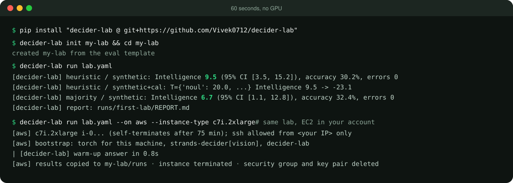
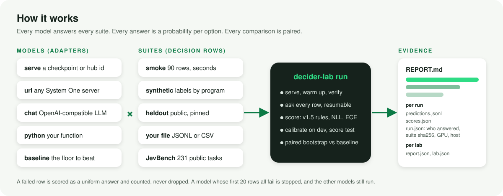
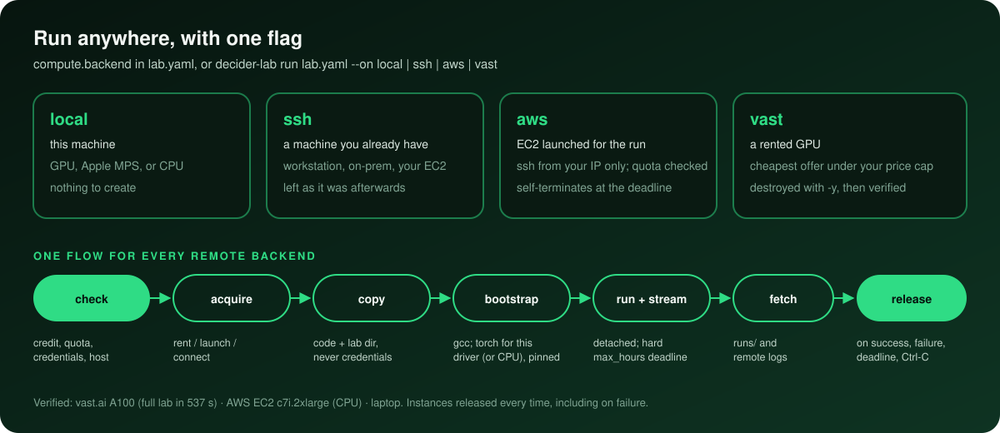
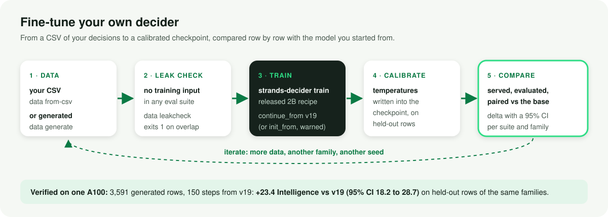
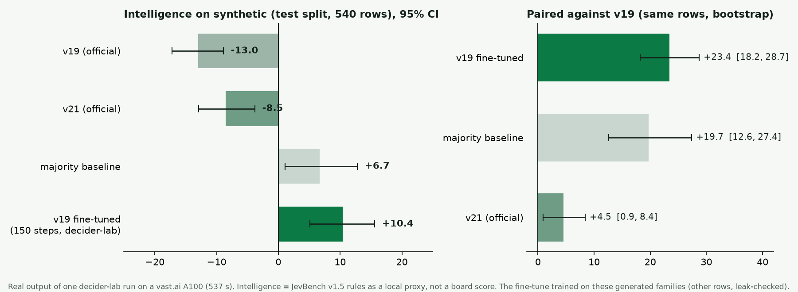

<p align="center">
  
</p>

<p align="center">
  <a href="https://github.com/Vivek0712/decider-lab/actions/workflows/tests.yml"></a>
  
  
  
  <a href="https://github.com/strands-labs/strands-decider"></a>
</p>

<p align="center">
  <a href="#-60-second-start">Start</a> ·
  <a href="#-how-it-works">How it works</a> ·
  <a href="#%EF%B8%8F-run-anywhere">Run anywhere</a> ·
  <a href="#-models-from-anywhere">Models</a> ·
  <a href="#-fine-tune-your-own-decider">Fine-tune</a> ·
  <a href="#-recipes">Recipes</a> ·
  <a href="#-real-results">Results</a> ·
  <a href="docs/">Docs</a>
</p>

---

**decider-lab** turns "I wonder if this model is better" into a report you can trust, in one command. It is the harness behind a long series of [Strands Decider](https://github.com/strands-labs/strands-decider) experiments, packaged so you never rebuild it: serve a model, ask it thousands of typed questions with known answers, score the answers with the JevBench rules, calibrate, compare models row by row with confidence intervals, fine-tune your own, and do all of it on whatever machine you have.

It speaks Strands Decider natively, and it is open to **any decision model**: a checkpoint, any System One server, an Amazon Bedrock model such as Nova Pro, a Strands Agents model, an OpenAI-compatible endpoint, or a Python function.

## ⚡ 60-second start



```bash
pip install "decider-lab @ git+https://github.com/Vivek0712/decider-lab"
decider-lab init my-lab && cd my-lab   # lab.yaml, an example model, a README
decider-lab run lab.yaml               # -> runs/first-lab/REPORT.md
decider-lab doctor                     # what this machine can do
```

The first run needs no GPU, no API key and no downloads: it evaluates two baselines and an example Python model on generated questions. Strands Decider is one line in `lab.yaml` away.

## 🧭 How it works



One file describes the whole experiment:

```yaml
name: first-lab
models:
  v19:      {serve: StrandsAgents/strands-decider-2B-hobson-v19}   # started, warmed up, verified, stopped
  mine:     {url: "http://10.0.0.5:8000"}                          # any System One server
  nova:     {bedrock: us.amazon.nova-pro-v1:0, region: us-east-1}   # Amazon Bedrock (or strands:, chat:)
  my_code:  {python: "my_model:Heuristic"}                          # your own function
  majority: {baseline: majority}                                    # the floor every model must beat
suites:
  - smoke                          # 90 rows, seconds
  - synthetic: {per_kind: 100}     # labels computed by programs, dev/test splits
  - heldout                        # public families Strands Decider never trains on
  - file: data/my_eval.jsonl       # yours
calibrate: true                    # temperatures fitted on dev, scored on test
baseline: majority                 # paired comparison, row by row, 95% CI
jevbench: [v19]                    # JevBench's 231 public tasks, v1.5 rules
```

| You want to... | decider-lab gives you |
|---|---|
| 📏 **know if a model is any good** | suites with known answers, the JevBench v1.5 rules as a local proxy, plus accuracy, NLL, Brier, RPS and calibration error, per question kind and per task family |
| ⚖️ **know if A beats B** | the same rows scored for both, a paired bootstrap 95% interval; a delta whose interval crosses zero is noise |
| 🎯 **make probabilities honest** | per-kind temperature fitted on `dev`, scored on `test`, for any model's outputs |
| 🛠️ **fine-tune your own decider** | data from a CSV or generators, a leak check, Strands Decider's own trainer, calibration, then the same evaluation |
| ☁️ **use a machine you don't have** | `--on ssh`, `--on aws`, `--on vast`, with the machine released even when the run fails |
| 📥 **use any checkpoint** | Hugging Face (pinned), S3, a URL or a folder, checksummed, cached and recorded |
| 📦 **publish an evaluation** | a suite is a JSONL file; its fingerprint is recorded in every run, so others can prove they scored the same rows |

## ☁️ Run anywhere



```bash
decider-lab run lab.yaml                                        # here
decider-lab run lab.yaml --on ssh  --host ubuntu@my-gpu-box     # your machine
decider-lab run lab.yaml --on aws  --instance-type g6e.xlarge   # EC2 for the run
decider-lab run lab.yaml --on vast --gpu A100_SXM4              # a rented GPU
```

Every remote run checks first (credit, AWS vCPU quota with the exact quota code to request, ssh reachability), installs torch built for that machine's NVIDIA driver (or CPU), streams the log back, copies `runs/` home, and **releases the machine on success, failure, deadline or Ctrl-C**. AWS instances also self-terminate at the deadline, so a dead laptop never leaves one running. → [docs/compute.md](docs/compute.md)

## 📥 Models from anywhere

```yaml
models:
  v19:  {serve: "hf://StrandsAgents/strands-decider-2B-hobson-v19@bb282d786bc251fd4e3068de3ada9ddbb38127cd"}
  mine: {serve: "s3://my-bucket/weights/mine.tar", sha256: 6346192d..., profile: research}
  v22:  {serve: "https://example.com/weights/v22.tar", sha256: 7305d520...}
  dev:  {serve: checkpoints/run-8}
```

Hugging Face (pinned commit recorded, gated repos via `HF_TOKEN`), S3 objects or prefixes, any URL, or a directory: pulled once, checked against `sha256`, extracted safely, cached, and recorded in every `run.json`. On remote backends, `s3://` sources become presigned links made on your machine, so no AWS credentials leave it. `decider-lab pull <source>` warms the cache; `decider-lab models` lists it. → [docs/models.md](docs/models.md)

## 🧪 Fine-tune your own decider



```bash
decider-lab init ft --template finetune && cd ft
decider-lab data from-csv my_decisions.csv --out data/train.jsonl
decider-lab data leakcheck data/train.jsonl --against synthetic heldout   # exit 1 on a leak
decider-lab run lab.yaml --on aws --instance-type g6e.xlarge              # train ... compare
```

```yaml
finetune:
  mine:
    from: StrandsAgents/strands-decider-2B-hobson-v19
    train: data/train.jsonl
    steps: 300
    calibrate_on: data/calib.jsonl
baseline: v19        # REPORT.md shows mine minus v19, row by row
```

It runs Strands Decider's own trainer with the released 2B recipe. decider-lab adds what is easy to get wrong around it: valid rows, no leaks, unknown training options refused before training starts, calibration, and a fair comparison. → [docs/finetune.md](docs/finetune.md)

## 📖 Recipes

<details open>
<summary><b>Your decisions in a CSV → an evaluation suite</b></summary>

```csv
state,question,answer,options,kind
"Order #123 arrived damaged",Should this go to a human?,yes,,
"Refund request, item unopened",Which queue?,returns,returns|billing|shipping,
"Thanks, all good!",How urgent is it?,low,low|medium|high,score
```

```bash
decider-lab data from-csv tickets.csv --out data/tickets.jsonl --task support/triage
decider-lab data split data/tickets.jsonl --out data/tickets.jsonl     # dev/test per family
```
Then add `{file: data/tickets.jsonl}` to `suites`.
</details>

<details>
<summary><b>Is checkpoint B really better than A?</b></summary>

```yaml
models:
  a: {serve: checkpoints/run-a}
  b: {serve: checkpoints/run-b}
suites: [{synthetic: {per_kind: 300}}, heldout]
baseline: a
```
REPORT.md gives `b - a` with a paired 95% interval per suite. Run both on the same kind of device: the same checkpoint on CPU and GPU moved 3 of 90 yes/no answers across the 0.2/0.8 band in our runs.
</details>

<details>
<summary><b>A 2B decider vs Amazon Nova Pro on your task</b></summary>

```yaml
models:
  v19:  {serve: "hf://StrandsAgents/strands-decider-2B-hobson-v19@bb282d786bc251fd4e3068de3ada9ddbb38127cd"}
  nova: {bedrock: us.amazon.nova-pro-v1:0, region: us-east-1, profile: research}
  # or: {strands: {provider: bedrock, model_id: us.amazon.nova-pro-v1:0}}
  # or any OpenAI-compatible endpoint: {chat: <model>, base_url: ..., api_key_env: ...}
suites: [{file: data/tickets.jsonl}]
calibrate: true
baseline: nova
```
Nova states its probabilities as JSON; the decider reads them off its head. NLL, ECE and the yes/no band share show which one you can put a threshold on. AWS credentials come from named environment variables (`access_key_id_env`, `secret_access_key_env`, `session_token_env`), a `profile`, or the default chain, and are never written to a run. → [docs/llms.md](docs/llms.md)
</details>

<details>
<summary><b>Plug in any model in five lines</b></summary>

```python
# my_model.py  ->  models: {mine: {python: "my_model:answer"}}
def answer(row):
    """One probability per option, in row["options"] order."""
    if row["kind"] == "noul":
        p = my_classifier(row["state"], row["instructions"])
        return [1 - p, p]                       # [P(no), P(yes)]
    return my_ranker(row["state"], [desc for _, desc in row["options"]])
```
</details>

<details>
<summary><b>JevBench public tasks against any endpoint</b></summary>

```bash
decider-lab jevbench --url http://127.0.0.1:8000 --out runs/jevbench-mine --label mine
```
JevBench's own harness, pinned, run against your server, and scored with the published v1.5 rules as a local proxy (never a board score).
</details>

<details>
<summary><b>Clean up anything left running</b></summary>

```bash
decider-lab compute ls   --on aws          # instances tagged decider-lab
decider-lab compute down --on vast --all
```
</details>

## 📊 Real results



| where | what ran | result |
|---|---|---|
| **vast.ai, 1x A100** | v19, v21 and a baseline on two suites; JevBench on v19; a 150-step fine-tune of v19 on 3,591 leak-checked generated rows, calibrated, served, compared | whole lab in **537 s**, 0 failures; JevBench v19 **169/231** (proxy 29.7, matching earlier v19 runs); fine-tune vs v19 **+23.4 [18.2, 28.7]**; instance destroyed |
| **AWS EC2 c7i.2xlarge** (CPU) | v19 served on CPU, smoke suite | 90/90 answered; instance terminated, security group and key pair deleted |
| **laptop** | baselines and a Python model, smoke + synthetic | 7 s |

The fine-tune trained on the same generated families it was scored on (other rows, leak-checked), so it shows the loop and what training on a family does, not general ability. The majority baseline beating v19 here is real and instructive: under the v1.5 band rule, an under-confident model loses points that a confident constant answer keeps. Read Intelligence together with accuracy and NLL; the report shows all three.

## 🛡️ Trust, built in

- **Who answered is recorded:** `/health`, model name, adapter, suite sha256, host, GPU and versions in every `run.json`.
- **Failures cost score, they never vanish:** a failed row is scored as a uniform answer and counted.
- **The server must answer before it is measured:** one real warm-up question, so a server that loads but cannot answer fails loudly (kernels that could not compile were a real trap).
- **Nothing is fitted on the rows it is scored on:** `+cal` fits on `dev` and scores on `test`.
- **No silent caps:** `--limit` is per kind and stated; JevBench numbers are labelled as a local proxy.
- **Machines come back:** release on every exit path, plus AWS self-termination.

## 🧩 Install

```bash
# core (PyYAML only)
pip install "decider-lab @ git+https://github.com/Vivek0712/decider-lab"
# everything
pip install "decider-lab[strands,heldout,aws,vast] @ git+https://github.com/Vivek0712/decider-lab"
```

| extra | adds |
|---|---|
| `strands` | Strands Decider (pinned GitHub main, with image input) to serve or fine-tune on this machine |
| `heldout` | the `heldout` suite (public datasets, built locally at pinned revisions) |
| `chess` | the chess family of the generated suites |
| `hub` | `hf://` model sources (included in `strands` and `heldout`) |
| `bedrock` / `strands-agents` | Amazon Bedrock models / Strands Agents models as answerers |
| `aws` / `vast` | the `--on aws` / `--on vast` backends, and `s3://` model sources (`aws`) |

Python 3.10+. Full fine-tuning (`continue_from`) needs a strands-decider that has it ([strands-decider#29](https://github.com/strands-labs/strands-decider/pull/29)); otherwise decider-lab falls back to `init_from` and tells you.

## 📚 Docs

| | |
|---|---|
| [Quickstart](docs/quickstart.md) | nothing → a report → a fine-tuned model |
| [Concepts](docs/concepts.md) | rows, suites, adapters, runs, and exactly how every score is defined |
| [Models](docs/models.md) | Hugging Face, S3, URLs, directories; pinning, checksums, caching |
| [LLMs](docs/llms.md) | Amazon Bedrock (Nova), Strands Agents, OpenAI-compatible endpoints; AWS credentials |
| [Fine-tuning](docs/finetune.md) | data, leak checks, the recipe, continue vs init |
| [Compute](docs/compute.md) | local, ssh, AWS and vast.ai; the traps the bootstrap handles |
| [Extending](docs/extending.md) | your own adapter or suite; publishing an evaluation |

## 🤝 Relationship to Strands Decider

decider-lab is a companion, not a fork: it calls `strands-decider serve`, `train` and `calibrate` and changes nothing about how Strands Decider trains or answers. Rows made here are valid Strands Decider training data, and Strands Decider's data is a valid decider-lab suite. Discussion: [strands-decider#45](https://github.com/strands-labs/strands-decider/issues/45).

## License

Apache-2.0. The generated families are computed by programs in this repository. Public datasets used by `heldout` are downloaded on your machine and keep their own licences, and JevBench task text stays in your local cache; nothing from either is redistributed.
