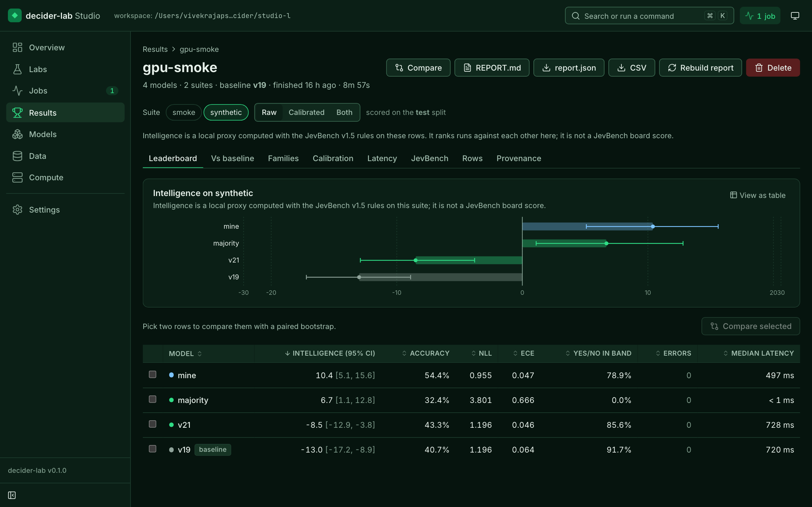
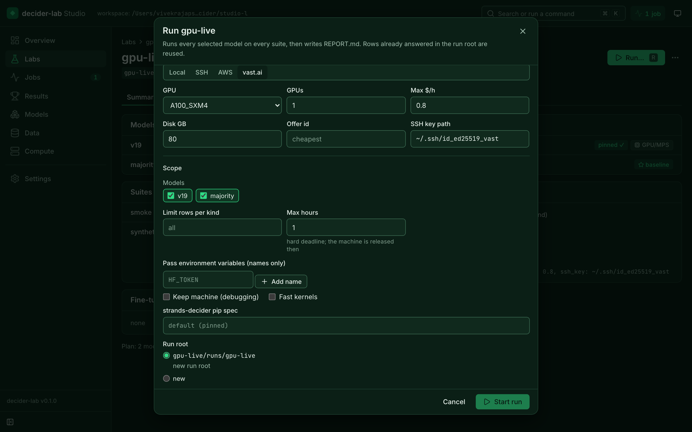
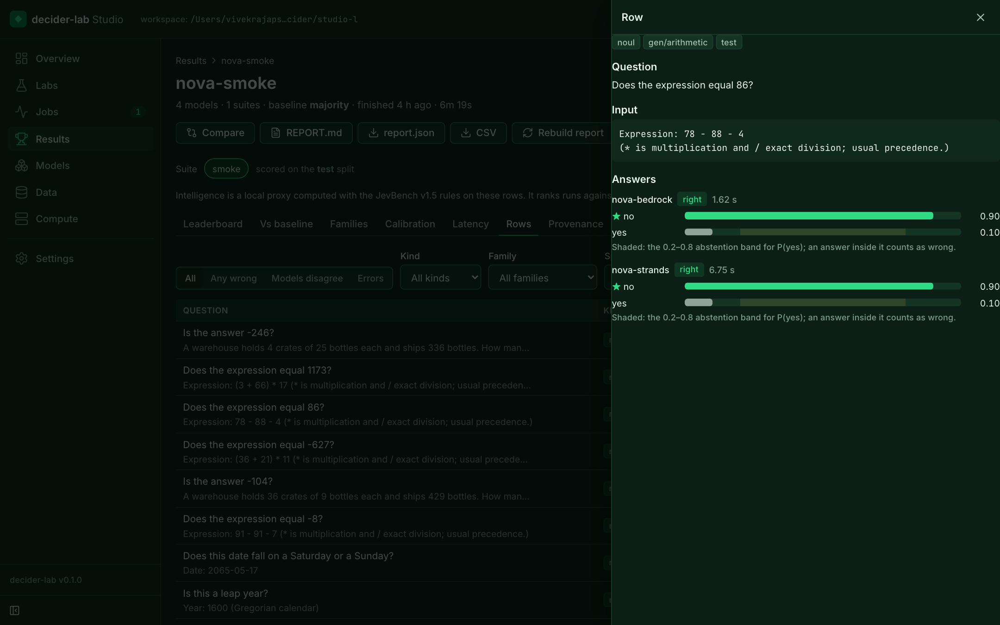
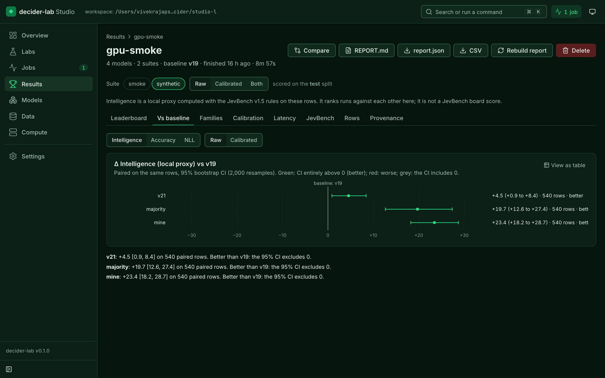
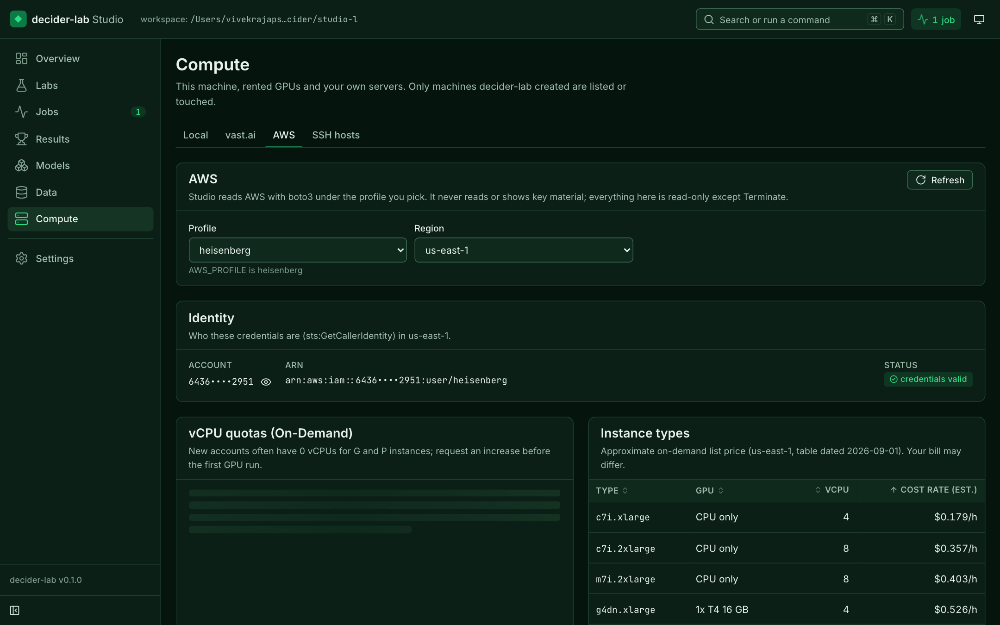

# decider-lab Studio

A local web portal for everything decider-lab does: labs, live jobs, results, models, data and compute. It runs on your machine, binds to 127.0.0.1, and sends nothing anywhere.

```bash
pip install "decider-lab[ui] @ git+https://github.com/Vivek0712/decider-lab"
decider-lab ui --workspace .          # prints a link with a one-time access token, like Jupyter
```



## Pages

| page | what you do there |
|---|---|
| **Overview** | KPIs (labs, results, active jobs, live machines and their burn rate, vast credit, AWS account), recent results, quick evaluation of any model on any suite, onboarding for an empty workspace |
| **Labs** | every `lab.yaml` in the workspace; create from a template; a YAML editor with inline validation (and secrets masked); a visual summary of models, suites and compute; **Run…** on any backend |
| **Jobs** | every run, pull and evaluation; a stage timeline (check → acquire → copy → bootstrap → run → fetch → release), per model/suite progress, live logs with search, telemetry charts (GPU utilisation, memory, temperature, power, rows/s, errors), cancel |
| **Results** | leaderboards with CI whiskers, raw vs calibrated, paired forest plot against the baseline, per-family heatmap, reliability diagrams, latency, JevBench, a row explorer joined across models, compare any two runs, export, provenance, delete |
| **Models** | the model cache (Hugging Face snapshots too); pull from `hf://` (pinned), `s3://` or `https://` with sha256, as a tracked job |
| **Data** | built-in and workspace suites with stats and label balance; CSV upload → decision rows; generate rows; split; leak check |
| **Compute** | this machine's doctor; vast.ai credit, offers and running instances; AWS identity, vCPU quotas (with the request command when a quota is 0), instance prices, tagged instances and Bedrock models for a profile and region; saved SSH hosts with a connection test |
| **Settings** | theme, density, default backend, job concurrency, pinning and sha256 policies, environment variables by name (never values), about |

⌘K / Ctrl+K opens the command palette; `g` then a letter jumps between pages; `?` lists every shortcut.

| | |
|---|---|
|  |  |
|  |  |

## Safe by default

- **Local only.** Binds to 127.0.0.1; a token is required on every API call; requests with a foreign `Host` are refused (DNS rebinding); strict security headers.
- **Money needs a typed confirmation.** Starting a paid run means typing the spend cap ("spend 0.60 on vast"); destroying or terminating machines and deleting results need typed phrases too, enforced by the server as well as the dialog.
- **Secrets never reach the browser.** Labs reference credentials by environment-variable name; values are masked in the editor, redacted from every log line, and never returned by the API.
- **Machines come back.** Cancelling a job releases its remote machine; Compute lists anything still billing and can destroy it.

## Tested

- 283 backend tests and 112 Playwright tests (every page at 1440 px and 390 px, accessibility checks with axe in both themes) run in CI with fake cloud fixtures.
- Live, on real accounts: AWS identity, quotas and 86 Bedrock models on a real profile; vast.ai credit, offers and instances; a GPU run launched from the Run dialog on a rented A100, followed through every stage, cancelled and released; a run failing to boot, released and its machine remembered so the next rental skips it.
